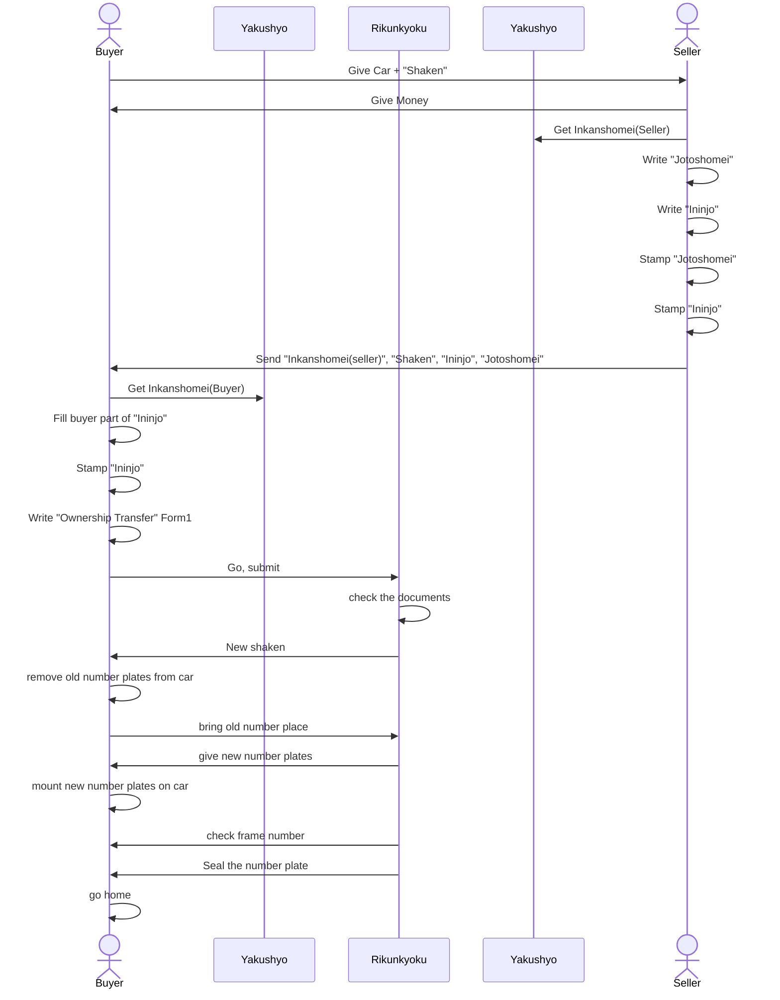

# BUILD
```bash
cmake -S . -B build -DCMAKE_BUILD_TYPE=Release -DCMAKE_CXX_COMPILER=g++-10 -G Ninja
ninja -C build
```


```mermaid

sequenceDiagram
    actor b as Buyer
    participant y1 as Yakushyo
    participant r as Rikunkyoku
    participant y2 as Yakushyo
    actor s as Seller
    b ->> s: Give Car + "Shaken"
    s ->> b: Give Money
    s ->> y2: Get Inkanshomei(Seller)
    s ->> s:   Write "Jotoshomei"
    s ->> s:   Write "Ininjo" 
    s ->> s:   Stamp "Jotoshomei"
    s ->> s:   Stamp "Ininjo"
    s ->> b:   Send "Inkanshomei(seller)", "Shaken", "Ininjo", "Jotoshomei" 
    b ->> y1:   Get Inkanshomei(Buyer)
    b ->> b:    Fill buyer part of "Ininjo"
    b ->> b: Stamp "Ininjo"
    b ->> b: Write "Ownership Transfer" Form1
    b ->> r: Go, submit
    r ->> r: check the documents
    r ->> b: New shaken
    b ->> b: remove old number plates from car
    b ->> r: bring old number place 
    r ->> b: give new number plates
    b ->> b: mount new number plates on car
    r ->> b: check frame number
    r ->> b: Seal the number plate
    b ->> b: go home

```